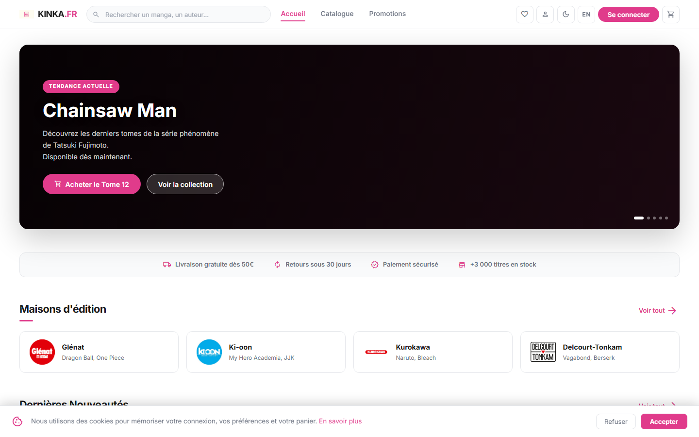
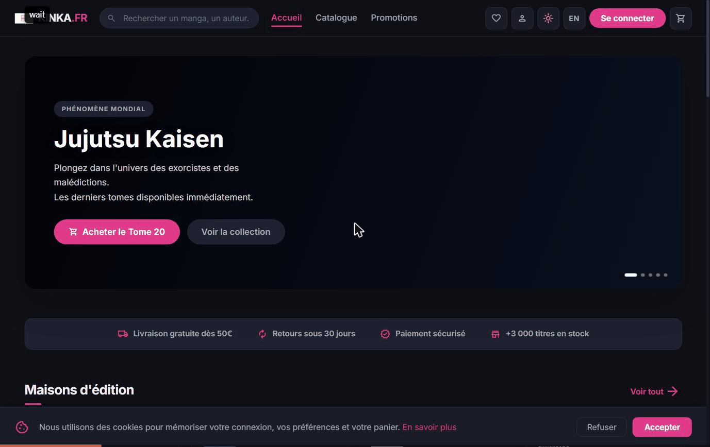

# 🛒 Kinka — E-commerce de Mangas

> **Plateforme e-commerce full-stack pour libraires de mangas** — catalogue filtré, panier hybride (localStorage invité / MySQL connecté), tunnel d'achat complet, annonces seconde main, avis, i18n FR/EN.
> Vanilla JS frontend (no framework), Node/Express/MySQL backend, JWT auth.

[](https://nodejs.org/)
[](https://expressjs.com/)
[](https://www.mysql.com/)
[](https://jwt.io/)
[](https://developer.mozilla.org/en-US/docs/Web/JavaScript)
[](https://www.figma.com/)

## 🌐 Démo en direct (UI statique sans backend)

**→ [https://abdoulrazack1.github.io/Kinka/page_accueil.html](https://abdoulrazack1.github.io/Kinka/page_accueil.html)**

[](https://abdoulrazack1.github.io/Kinka/page_accueil.html)



> ⚠️ La version live sur GitHub Pages affiche l'UI complète (CSS, navigation, mode sombre, i18n) mais **sans données dynamiques** — le backend Node/Express/MySQL n'est pas déployé. Pour la version complète avec catalogue, panier et auth, suis les instructions d'installation ci-dessous.

---

## 💡 Pourquoi Kinka

| Use case | Comment Kinka le résout |
|---|---|
| **Visiteur ajoute des articles** | Panier en `localStorage` — pas de friction d'inscription |
| **Visiteur s'inscrit après** | Migration auto du panier `localStorage` → MySQL au login (sans perte) |
| **Vendre du neuf et de l'occasion** | Catalogue principal + section "Annonces" avec CRUD utilisateur |
| **i18n FR/EN** | Système de traduction custom, 1800+ chaînes |
| **Auth solide pour DWWM** | JWT + bcrypt (12 rounds) + rate-limit + auth-guard côté client |

**Pas une démo** — 41 pages HTML, 38 feuilles CSS, 18 scripts JS, 32 endpoints API, mode sombre + responsive complet.

---

## Stack

**Front** : HTML5 · CSS3 · JavaScript ES6+ (sans framework) · Figma
**Back**  : Node.js (Express) · MySQL · JWT (jsonwebtoken) · bcryptjs
**Outils** : Git · Live Server (VS Code, port 5503)

## Fonctionnalités

**Catalogue**
- Filtres dynamiques multi-critères (catégorie, état, éditeur, prix, auteur) sans rechargement
- Moteur de recherche instantané (titre, série, auteur, éditeur, description)
- Pages dédiées : nouveautés, promotions, coups de cœur, coffrets, occasion, par catégorie

**Panier & commande**
- Panier hybride : localStorage si visiteur, base MySQL si connecté
- Tunnel complet : panier → paiement (avec adresse) → confirmation → suivi
- Calcul automatique du sous-total, des frais de livraison (gratuits dès 50 €) et du TTC
- Décrémentation transactionnelle des stocks

**Compte utilisateur**
- Inscription, connexion, mot de passe oublié, modification du profil
- Stockage JWT en localStorage + cookie « se souvenir de moi » (30 jours)
- Pages protégées par auth-guard (panier, paiement, profil, favoris, …)

**Favoris** : ajout/retrait synchronisé entre localStorage (visiteur) et BDD (connecté)

**Annonces seconde main** : création/édition/suppression par les utilisateurs

**Avis** : note + commentaire (une fois par produit)

**Légal & support** : CGU, CGV, politique de retour, FAQ, contact (formulaire branché à l'API)

**Mode sombre** : toggle persistant + respect du `prefers-color-scheme` système

**i18n** : système de traduction FR/EN (1800+ chaînes)

## Structure du projet

```
Kinka/
├── README.md                       ← ce fichier
├── .gitignore                      ← exclut node_modules, .env, builds
├── .vscode/                        ← config Live Server (port 5503)
│
├── client/                         ← Front
│   ├── pages/                      ← 42 pages HTML
│   │   ├── page_accueil.html       ← homepage avec carrousel
│   │   ├── page_catalogue.html     ← catalogue filtré
│   │   ├── page_detail_produit.html← fiche produit (+ onglet avis)
│   │   ├── page_annonces.html      ← annonces entre membres
│   │   ├── page_admin.html         ← back-office
│   │   └── …
│   └── assets/
│       ├── css/                    ← feuilles de style (1 par page + partagées)
│       ├── images/                 ← logos, bannières, visuels
│       └── js/                     ← scripts frontend
│           ├── server-client.js ← client API + auth + cookies + toast
│           ├── kinka-cards.js      ← rendu des cartes produit
│           ├── admin.js            ← logique du back-office
│           ├── avis.js             ← avis clients
│           └── …
│
├── server/                         ← Backend Node.js (MVC)
│   ├── src/
│   │   ├── server.js               ← point d'entrée : middlewares + montage des routes
│   │   ├── routes/                 ← déclaration des URL (chemin + middlewares)
│   │   ├── controllers/            ← logique applicative
│   │   ├── models/                 ← accès aux données : tout le SQL vit ici
│   │   ├── views/emails/           ← gabarits des emails envoyés par le serveur
│   │   ├── services/               ← dépendances externes (SMTP, API Jikan)
│   │   ├── middleware/             ← auth JWT, rôle admin, validation
│   │   └── config/db.js            ← pool MySQL (mysql2/promise)
│   ├── scripts/
│   │   ├── seed_big.js             ← jeu de données de démonstration
│   │   ├── sync_mangas_jikan.js    ← import depuis MyAnimeList
│   │   ├── sync_covers_mangadex.js ← une couverture par tome
│   │   └── make_admin.js           ← promotion d'un compte en administrateur
│   └── .env.example                ← copier en .env
│
├── database/
│   ├── schema.sql                  ← structure seule
│   ├── seed.sql                    ← données de démonstration
│   └── migrations/                 ← évolutions du schéma
│
├── docs/                           ← documentation, archives, captures
└── tools/                          ← utilitaires de développement
```

## Démarrage rapide

### Prérequis

- **Node.js** ≥ 18 (pour `fetch` natif)
- **MySQL** ≥ 8 ou **MariaDB** ≥ 10.5
- **VS Code** avec extension **Live Server** (recommandé pour le front)

### 1. Cloner le projet

```bash
git clone https://github.com/Abdoulrazack1/Kinka.git
cd Kinka
```

### 2. Installer le backend

```bash
npm install --prefix server
npm install
```

### 3. Créer la base de données

Dans MySQL :
```sql
CREATE DATABASE kinka_db CHARACTER SET utf8mb4 COLLATE utf8mb4_unicode_ci;
```

Puis importer le schéma :
```bash
mysql -u root -p kinka_db < kinka_db.sql
```

### 4. Configurer l'environnement

```bash
cp .env.example .env
```

Éditer `.env` avec vos valeurs :
```
PORT=3000

DB_HOST=127.0.0.1
DB_PORT=3306
DB_NAME=kinka_db
DB_USER=root
DB_PASS=ton_mot_de_passe

# Générer une clé robuste avec :
#   node -e "console.log(require('crypto').randomBytes(64).toString('base64'))"
JWT_SECRET=remplacer_par_une_cle_aleatoire_longue
JWT_EXPIRES_IN=7d

CLIENT_URL=http://127.0.0.1:5503
```

### 5. Importer les données initiales

```bash
npm run import          # Importe les 80+ mangas de docs/archive/mangadb.js
node create_demo_user.js   # Crée le compte démo : demo@kinka.fr / demo1234
```

(Optionnel : `npm run sync` pour ajouter ~100 mangas depuis MyAnimeList via Jikan)

### 6. Lancer le backend

```bash
npm start            # Production
npm run dev          # Développement (rechargement auto avec nodemon)
```

Vérifier :
```
GET http://localhost:3000/api/health
→ { "success": true, "message": "Kinka API en ligne 🎌", "version": "2.0.0" }
```

### 7. Lancer le front

Ouvrir le projet dans VS Code et clic-droit sur `page_accueil.html` → **Open with Live Server**.
Le front sera servi sur `http://127.0.0.1:5503`.

> **Démarrage** : `npm run dev` sert à la fois l'API et le site sur http://localhost:3000 — front et API sur la même origine, sans configuration d'hôte virtuel. Le site reste servable par Apache : le `.htaccess` à la racine redirige vers `client/` et bloque l'accès web à `server/`, `database/`, `docs/` et `tools/`.

## Compte de démonstration

Après `node create_demo_user.js` :

| Email           | Mot de passe | Plan    |
|-----------------|--------------|---------|
| demo@kinka.fr   | demo1234     | Premium |

## Endpoints de l'API

| Méthode | Route                        | Auth | Description                       |
|---------|------------------------------|------|-----------------------------------|
| GET     | /api/health                  | —    | Vérification du serveur           |
| POST    | /api/auth/register           | —    | Inscription                       |
| POST    | /api/auth/login              | —    | Connexion                         |
| POST    | /api/auth/forgot             | —    | Demande de réinitialisation       |
| GET     | /api/auth/me                 | ✓    | Profil courant                    |
| PUT     | /api/auth/me                 | ✓    | Modifier le profil                |
| PUT     | /api/auth/password           | ✓    | Changer le mot de passe           |
| DELETE  | /api/auth/me                 | ✓    | Supprimer le compte               |
| GET     | /api/produits                | —    | Liste filtrée + paginée           |
| GET     | /api/produits/search?q=      | —    | Recherche (titre, série, auteur…) |
| GET     | /api/produits/:id            | —    | Détail d'un produit               |
| GET     | /api/panier                  | ✓    | Mon panier                        |
| POST    | /api/panier                  | ✓    | Ajouter un article                |
| PUT     | /api/panier/:id              | ✓    | Modifier la quantité              |
| DELETE  | /api/panier/:id              | ✓    | Retirer un article                |
| DELETE  | /api/panier                  | ✓    | Vider le panier                   |
| GET     | /api/favoris                 | ✓    | Mes favoris                       |
| POST    | /api/favoris                 | ✓    | Ajouter un favori                 |
| DELETE  | /api/favoris/:id             | ✓    | Retirer un favori                 |
| DELETE  | /api/favoris                 | ✓    | Vider les favoris                 |
| GET     | /api/commandes               | ✓    | Historique commandes              |
| GET     | /api/commandes/:id           | ✓    | Détail d'une commande             |
| POST    | /api/commandes               | ✓    | Passer une commande (transaction) |
| GET     | /api/annonces                | —    | Liste des annonces (occasion)     |
| GET     | /api/annonces/mes-annonces   | ✓    | Mes annonces publiées             |
| POST    | /api/annonces                | ✓    | Publier une annonce               |
| PUT     | /api/annonces/:id            | ✓    | Modifier une annonce              |
| DELETE  | /api/annonces/:id            | ✓    | Supprimer une annonce             |
| GET     | /api/avis?produit_id=        | —    | Avis d'un produit                 |
| POST    | /api/avis                    | ✓    | Publier ou modifier un avis       |
| DELETE  | /api/avis/:produit_id        | ✓    | Supprimer mon avis                |
| GET     | /api/mangas/search?q=        | —    | Recherche Jikan (sans BDD)        |
| POST    | /api/mangas/sync             | —    | Sync mangas populaires            |
| POST    | /api/mangas/sync-one         | —    | Importer un manga par mal_id      |
| POST    | /api/newsletter              | —    | Inscription newsletter            |
| POST    | /api/contact                 | —    | Envoyer un message de contact     |

Toutes les réponses suivent le format :
```json
{ "success": true,  "data":  { … } }
{ "success": false, "error": "Message" }
{ "success": false, "errors": { "champ": "Message" } }
```

Les routes protégées attendent un header :
```
Authorization: Bearer <token_jwt>
```

## Utilisation côté front

Toute page HTML inclut les scripts dans cet ordre (gérés par auth-guard et panier hybride) :
```html
<script src="../assets/js/server-client.js"></script>
<script src="../assets/js/kinka-auth-guard.js"></script>
<script src="../assets/js/kinka-cards.js"></script>
<script src="../assets/js/authentification.js"></script>
<script src="../assets/js/panier.js"></script>
<script src="../assets/js/favoris.js"></script>
<script src="../assets/js/darkmode.js"></script>
<script src="../assets/js/recherche.js"></script>
<script src="../assets/js/translate.js"></script>
```

Exemples d'utilisation :
```js
// Connexion (avec « se souvenir de moi »)
const user = await KinkaAPI.auth.login('demo@kinka.fr', 'demo1234', true);

// Catalogue filtré
const mangas = await KinkaAPI.produits.getAll({ categorie: 'Shônen', promo: '1' });

// Panier
await KinkaAPI.panier.add('one-piece-105', 1);

// Toast (XSS-safe, défini globalement)
showToast('Ajouté au panier !', 'success');
```

Pour pointer vers une autre URL d'API, définir avant le chargement du client :
```html
<script>window.KINKA_API_URL = 'https://api.kinka.fr/api';</script>
<script src="../assets/js/server-client.js"></script>
```

## Sécurité

- Mots de passe hachés avec **bcrypt** (12 rounds)
- Authentification par **JWT** (HS256, 7 jours par défaut)
- **Rate limiting** : 100 req/min global, 10 req/15 min sur `/api/auth`
- Validation systématique des entrées (`middleware/validate.js`)
- Requêtes paramétrées (mysql2) → pas d'injection SQL
- XSS : échappement HTML dans toutes les fonctions de rendu (`_esc`, `_e`)
- CORS configurable via `CLIENT_URL`
- Bannière de consentement RGPD (cookies)
- Auth-guard côté client pour les pages sensibles

## Bonnes pratiques de production

- Remplacer `JWT_SECRET` par une clé forte générée aléatoirement (64 octets)
- Restreindre `CLIENT_URL` à votre domaine de production (au lieu de `*`)
- Activer HTTPS (les cookies sont en `SameSite=Lax` ; passer en `Strict` + `Secure` derrière HTTPS)
- Mettre en place un vrai service d'envoi d'emails pour `/auth/forgot` (le code actuel logge en console)
- Pré-générer les indexes (déjà inclus pour `categorie`, `promo`, `nouveaute`, `bestseller`, `commandes.user_id`)
- Brancher un reverse proxy (nginx) devant le Node + servir le statique depuis nginx

## Auteur

**Abdoulrazack Abdillahi Mahamoud** — [abdoul.abdillahi@gmail.com](mailto:abdoul.abdillahi@gmail.com)

Projet réalisé dans le cadre de la formation Développeur Web et Web Mobile (DWWM).
